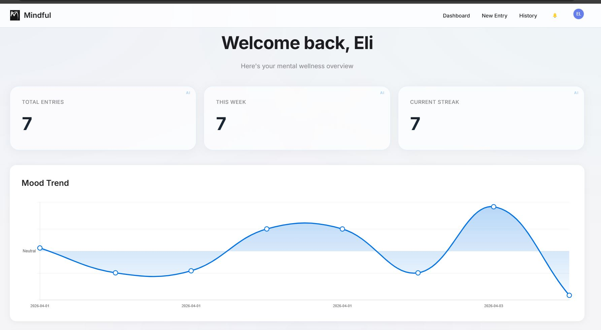
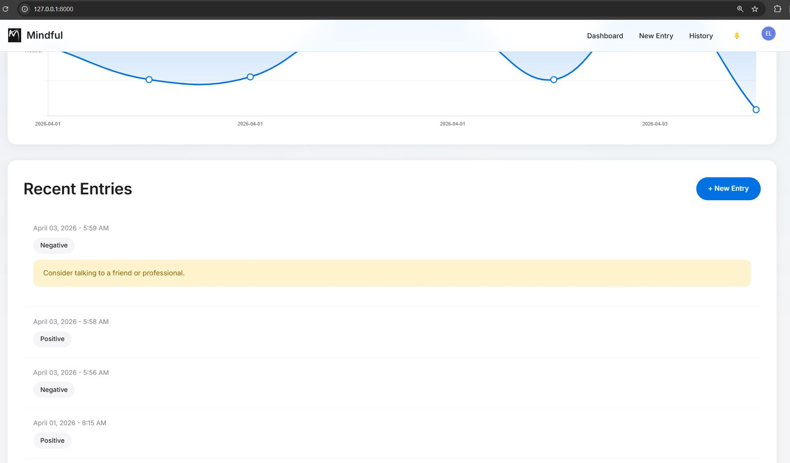
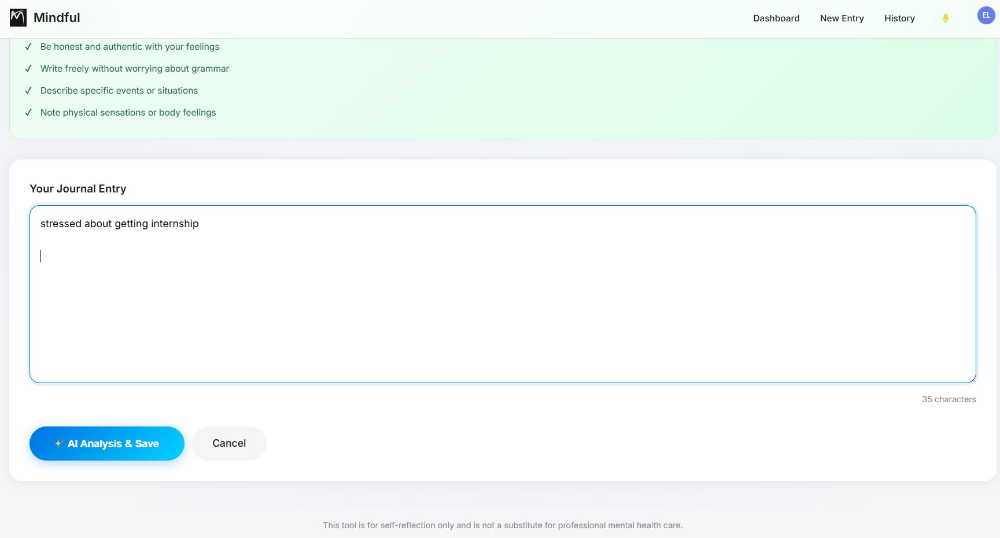
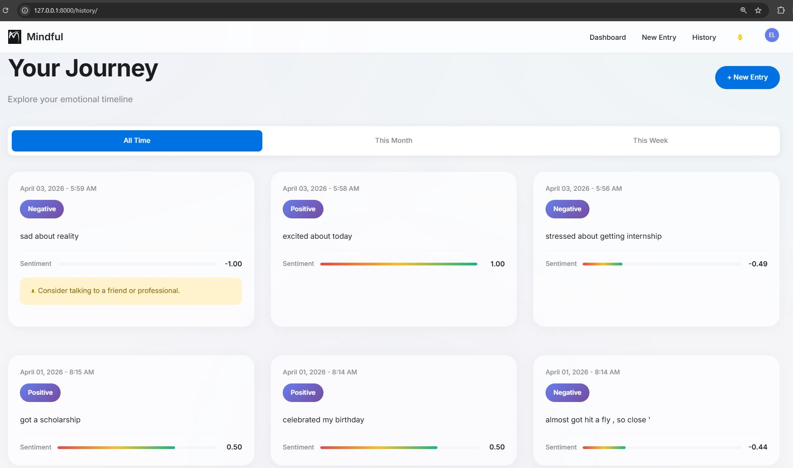
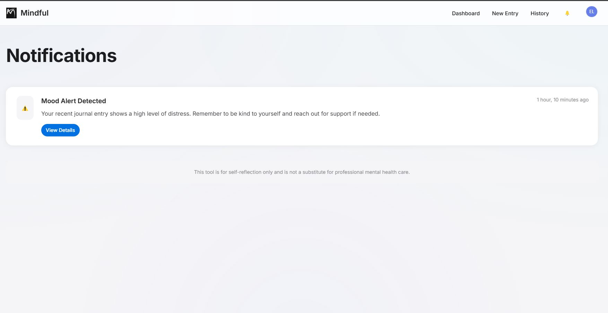

# 🧠 Mindful - AI Mental Health Tracker

Mindful is a modern, AI-powered mental health monitoring system designed to help users track their emotional well-being through journaling and advanced sentiment analysis.

Created by **[Blessing Zimbango Elias](https://www.linkedin.com/in/blessing-zimbango-elias/)**

Contributors **[Rittik](https://github.com/hritik-coder07)**

& 

## Setup Instructions
Copy `.env` from `.env.example` and use your own API keys.

## ✨ Features

- 🤖 **AI Emotion Analysis**: Real-time sentiment detection using MentalBERT models.
- 📊 **Visual Mood Trends**: Beautiful, interactive charts to track your emotional journey.
- 🔔 **Smart Notifications**: Proactive alerts for concerning emotional patterns.
- 📱 **Mobile-First Design**: Premium Apple-inspired UI that works perfectly on all devices.
- ☁️ **Supabase Integration**: Secure cloud storage for profiles and journal logs.

## 🚀 How to Run

### 1. Setup Environment

Clone the project and create a virtual environment:

```bash
python -m venv venv
.\venv\Scripts\activate
pip install -r requirements.txt
```

### 2. Configure Database

Ensure your `.env` file is set up with your Supabase credentials. If you're running locally with SQLite:

```bash
python manage.py makemigrations
python manage.py migrate
```

### 3. Start the Server

```bash
python manage.py runserver
```

Visit `http://127.0.0.1:8000` to start tracking your mood!

---

## 📸 Screenshots

<div align="center">








</div>

---

🔗 Connect with me on [LinkedIn](https://www.linkedin.com/in/blessing-zimbango-elias/)
Thank you
